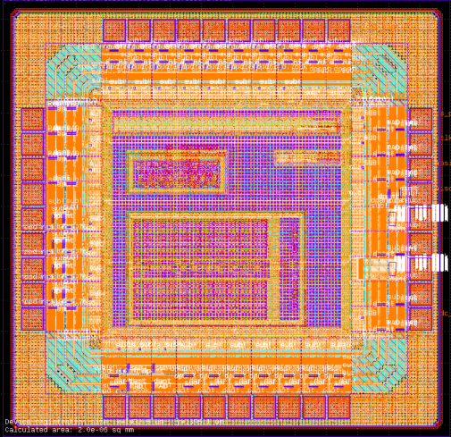

# ASICONE IHP sg13g2



## Contents:

- Self-generated 5-bit SAR ADC (SARADC).
- Feed-forward 101-element ring oscillator.
- Feed-forward 13-element ring oscillator.
- SPI core.
- All digital cells are custom-made. 18-track cells (Which is experimental)
    - sg13g2 for custom-made regular cells
    - sg13g2f for floating-body cells (For the ADC)
- 38 pins. Using regular IO.

This chip was not designed for industrial purposes. Only for research and evaluation
of open-source tools and the IHP `sg13g2` PDK.

## Filestructure

The structure is done by [project]/[step|type]. Hope is not confusing.

```
  📁asicone_sg13g2
   ┗ 📁digital          # Digital circuit flow (For SPI, using custom standard cells)
    ┗ 📁rtl             #  RTL files
    ┗ 📁syn             #  Synthesis flow (yosys)
    ┗ 📁pnr             #  Place-and-Route flow (OpenROAD)
    ┗ 📁signoff         #  Signoff steps. GDS creation, DRC and LVS are performed here
   ┗ 📁generic          # Generic digital flow (Using the provided sg13g2_stdcells)
    ┗ 📁syn             #  Synthesis flow (yosys)
    ┗ 📁pnr             #  Place-and-Route flow (OpenROAD)
   ┗ 📁saradc_auto      # SARADC auto flow (Documentation inside)
   ┗ 📁ro_reliability   # Feed-forward Ring Oscillator Analog IP
   ┗ 📁chip             # Final chip flow
    ┗ 📁padring         #  Pad-ring generation
    ┗ 📁sealring        #  Sealring fixed GDS & LEF files
    ┗ 📁rtl             #  RTL files
    ┗ 📁pnr             #  Place-and-Route flow (OpenROAD)
    ┗ 📁signoff         #  Signoff steps. GDS creation, filler insertion, DRC and LVS are performed here
```

## Errdata and sins commited

- To pass LVS with IO, `ptap1` was ignored totally. We even also created a new 
  main rule file to just skip the ptaps (Why the ptap extractor gives me a diode 
  though?)
    - NOTE: Putting the `ptap1` as a diode in the source kinda works, but only 
      if you have ONE diode at a time. If you merge them in layout, will create 
      an unique diode, mismatching with the source if you have them separated.
- For convergence sake, sometimes we attached capactors to the transistors.
- In the IO cells, we added a missing `PolyRes` layer missing in some of the
  subcells for recognition of the resistors `rppd`.
- DRC passes almost fully. We have errors in the IO involving `Sdiod.d` and 
  `Sdiod.e`. No idea if we need to fix them.
- Source code for the SAR ADC generator is "To be Published". We are discussing 
  with the team at SymbioticEDA and the University of Tokyo. However, we provide
  enough information for simulation and LVS.
- Custom cells are sub-optimal. The standard cell generator is still on development.
- Characterization of cells are poor. Technically copied from `sky130`. This PDK
  doesn't have RC extraction of any kind, and makes the characterization impossible.
- We do not use OpenROAD-flow-scripts. The flow is custom.

May god give us the blessing of this chip working.

# Acknoledge

- SARADC paper: [Read it here.](https://ieeexplore.ieee.org/document/11002493)
- Symbiotic EDA which uses this design for evaluation of tools.
- The University of Tokyo, which uses this design for research purposes only.

